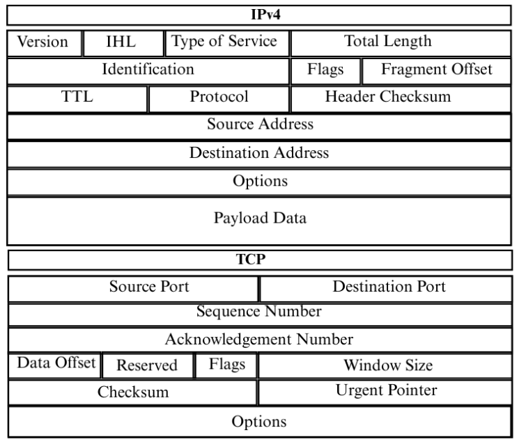

# Optimized-BERT-Intrusion-Detection-System

---

<p align="center">
  📄 <b>IEEE BlackSeaCom 2025 Paper Publication</b><br><br>
  This repository provides the implementation and supplementary resources for the research study<br>
  <b>“OB-IDS: Optimized BERT-based Intrusion Detection System”</b><br>
  <i>Accepted for presentation and publication in the Proceedings of IEEE BlackSeaCom 2025</i>
</p>

---

## 📜 Citation  

If you use this work, please cite OB-IDS paper:  

**IEEE Reference:**  
G. Ateş, B. Çelebi, U. A. Semerci, E. Çapkan, B. Yıldırım, İ. Ar, and T. Arsan,  
"OB-IDS: Optimized BERT-based Intrusion Detection System," *Proc. IEEE BlackSeaCom*, Istanbul, Turkey, 2025.  

**BibTeX Reference:**  

```bibtex
@inproceedings{ates2025obids,
  author    = {Göktuğ Ateş and Başar Çelebi and Umut Aytuğ Semerci and Emircan Çapkan and Batuhan Yıldırım and İlktan Ar and Taner Arsan},
  title     = {OB-IDS: Optimized BERT-based Intrusion Detection System},
  booktitle = {Proc. IEEE International Black Sea Conference on Communications and Networking (BlackSeaCom)},
  year      = {2025},
  address   = {Istanbul, Turkey},
  publisher = {IEEE},
  pages     = {1-4},                   
  doi       = {10.1109/BlackSeaCom.2025.xxxxx},  
  isbn      = {978-1-6654-xxxx-x}      
}
```

---

## 📊 Dataset Information

| 🏷️ Feature   | 📌 Description |
|--------------|--------------------------------------------------------------------------|
| **Name**     | 🛡️ *Network Intrusion Dataset* |
| **Source**   | [](https://huggingface.co/datasets/gates04/network-intrusion-dataset) |
| **Area of Use** | 🔍 *Intrusion Detection* <br> 🚨 *Anomaly Detection* |
| **Instances**      | 🗃 **Total:** ~1.69 M packets <br>&nbsp;&nbsp;&nbsp;• **Train:** ~1.18 M (70%) <br>&nbsp;&nbsp;&nbsp;• **Validation:** ~0.25 M (15%) <br>&nbsp;&nbsp;&nbsp;• **Test (Inference Only):** ~0.25 M (15%) |
| **Classes** | 🗂️ 24 classes <br><details><summary><small>See Full List</small></summary> <table border="1" cellspacing="0" cellpadding="5" style="font-size:90%"> <tr><th>Category</th><th>Classes</th></tr><tr><td><b>🟢 Normal</b></td><td>Normal</td></tr><tr><td><b>🛡 DoS / DDoS</b></td><td>Slowloris, GoldenEye, Hulk, SlowHTTPTest, DDoS</td></tr><tr><td><b>🌐 Web Attacks</b></td><td>XSS, SQL Injection, Brute Force</td></tr><tr><td><b>⚙️ Other Attacks</b></td><td>Exploit, Fuzzers, Infiltration, PortScan, Bot, Heartbleed, Worms</td></tr></table> </details> | 
| **Features** | 🧩 Two main groups: <br>&nbsp;&nbsp;&nbsp;• **Header Fields** — IP src/dst, ports, protocol, flags, length, etc. <br>&nbsp;&nbsp;&nbsp;• **Payload** — raw packet content (hex/byte sequence) <br><details><summary><small>See TCP/IP Packet Structure </small></summary><br></details> |
| **Format**   | 🗂️ *Parquet* |
| **Original Sources** | 🏛️ CIC-IDS2017 & UNSW-NB15 datasets |
