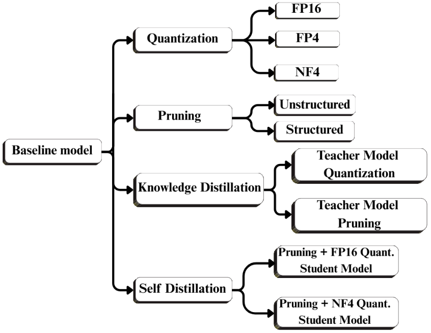
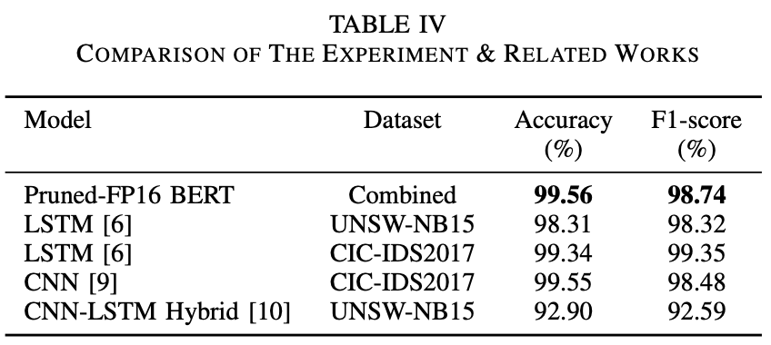

# Optimized BERT-based Intrusion Detection System

<p align="center">
  
</p>

<p align="center">
  <b>IEEE BlackSeaCom 2025 Paper Publication</b><br><br>
  This repository provides the implementation and supplementary resources for the research study<br>
  <b>“OB-IDS: Optimized BERT-based Intrusion Detection System”</b><br>
  <i>Accepted for presentation and publication in the Proceedings of IEEE BlackSeaCom 2025</i>
</p>

<p align="center">
  <a href="./LICENSE">
    
  </a>&nbsp;
  <a href="https://www.python.org/downloads/">
    
  </a>&nbsp;
  <a href="https://pytorch.org/get-started/">
    
  </a>&nbsp;
  <a href="https://developer.nvidia.com/cuda-zone">
    
  </a>&nbsp;
  <a href="https://doi.org/10.1109/BlackSeaCom65655.2025.11193891">
    
  </a>&nbsp;
</p>

---

## 📜 Citation  

If you use this work, please cite OB-IDS paper:  

**IEEE Reference:**  
G. Ateş et al., "OB-IDS: Optimized BERT-based Intrusion Detection System," 2025 IEEE International Black Sea Conference on Communications and Networking (BlackSeaCom), Chisinau, Moldova, Republic of, 2025, pp. 1-4, doi: 10.1109/BlackSeaCom65655.2025.11193891. 


**BibTeX Reference:**  

```bibtex
@INPROCEEDINGS{11193891,
  author = {
    Ateş, Göktuğ and 
    Çelebi, Başar and 
    Semerci, Umut Aytuğ and 
    Çapkan, Emircan and 
    Yıldırım, Batuhan and 
    Ar, İlktan and 
    Arsan, Taner
  },
  booktitle={2025 IEEE International Black Sea Conference on Communications and Networking (BlackSeaCom)}, 
  title={OB-IDS: Optimized BERT-based Intrusion Detection System}, 
  year={2025},
  pages={1-4},
  doi={10.1109/BlackSeaCom65655.2025.11193891}}
```

---

## 📊 Dataset Information

| 🏷️ Feature   | 📌 Description |
|--------------|--------------------------------------------------------------------------|
| **Name**     | 🛡️ *Network Intrusion Dataset* |
| **Source**   | [](https://huggingface.co/datasets/gates04/network-intrusion-dataset) |
| **Area of Use** | 🔍 *Intrusion Detection* <br> 🚨 *Anomaly Detection* |
| **Instances**      | 🗃 **Total:** ~1.69 M packets <br>&nbsp;&nbsp;&nbsp;• **Train:** ~1.18 M (70%) <br>&nbsp;&nbsp;&nbsp;• **Validation:** ~0.25 M (15%) <br>&nbsp;&nbsp;&nbsp;• **Test (Inference Only):** ~0.25 M (15%) |
| **Classes** | 🗂️ 24 classes <br><details><summary><small>See Full List</small></summary> <table border="1" cellspacing="0" cellpadding="5" style="font-size:90%"> <tr><th>Category</th><th>Classes</th></tr><tr><td><b>🟢 Normal</b></td><td>Normal</td></tr><tr><td><b>🛡 DoS / DDoS</b></td><td>Slowloris, GoldenEye, Hulk, SlowHTTPTest, DDoS</td></tr><tr><td><b>🌐 Web Attacks</b></td><td>XSS, SQL Injection, Brute Force</td></tr><tr><td><b>⚙️ Other Attacks</b></td><td>Exploit, Fuzzers, Infiltration, PortScan, Bot, Heartbleed, Worms</td></tr></table> </details> | 
| **Features** | 🧩 Two main groups: <br>&nbsp;&nbsp;&nbsp;• **Header Fields** — IP src/dst, ports, protocol, flags, length, etc. <br>&nbsp;&nbsp;&nbsp;• **Payload** — raw packet content (hex/byte sequence) <br><details><summary><small>See TCP/IP Packet Structure </small></summary><br></details> |
| **Format**   | 🗂️ *Parquet* |
| **Original Sources** | 🏛️ CIC-IDS2017 & UNSW-NB15 datasets |

---

## 🔬 Fine-Tuning Approaches

<p id="fig-exp-structure" align="center">
  
</p>

***1.*** ***Baseline*** ***Model:*** The Baseline model has been fine tuned for the task of classifying packets on 24 different classes by converting the flow, header and payload information contained in packets to text using BERT architecture.

***2.*** ***Quantization:*** It reduces the weights of the model using precision levels. It allows the model to consume less memory, inference time and energy in terms of the system resources at low system requirements. 

***3.*** ***Pruning:*** It aims to ensure that the model provides performance
enhancement in terms of throughput by removing the weights of the model or the components such as neurons located in its intermediate layers.

***4.*** ***Knowledge*** ***Distillation (KD):*** It aims to use soft labels emerging from the teacher model and the ground truth labels contained in the dataset according to the loss function determined during the fine tuning process on the student model, without compromising accuracy and F1-score.

***5.*** ***Self*** ***Distillation (SD):*** It employs the model as its own teacher and it has been shown to get better current performance by not adding parameters to the model or reducing overfitting.

---

## 📑 Experimental Results

### Hardware Specs for Model Fine-Tuning & Evaluation

| **Setting**                  | **Fine-Tuning**                                                                  | **Testing**                                                                       |
|------------------------|----------------------------------------------------------------------------------------|--------------------------------------------------------------------------------------------|
| **GPU Model**              | NVIDIA A100                                                                            | NVIDIA L4                                                                                 |
| **Memory Capacity**          | 40 GB                                                                                  | 22.5 GB                                                                                   |
| **Memory Type**              | HBM2E (High Bandwidth Memory)                                                | GDDR6 VRAM                                                                                |
                 

### Metrics for Model Fine-Tuning & Evaluation
- **Model Size (MB)**
- **Accuracy (%)**
- **F1-score (%)**
- **Throughput (flows/s)**, which express the number of m flows in each n batch with the batch rate (n batches per second), such as (1 batch/s x 32 flows)

### Summary of Experimental Results

| Method                              | Size (MB) | Accuracy (%) | F1-score (%) | Throughput (flows/s) |
|-------------------------------------|-----------|--------------|--------------|---------------------------|
| **Baseline Model**                  | 251.01    | 99.5627      | 98.70        | **3702** |
| **NF4 Quantization**                | **21.11** | 99.5639      | **98.74**    | 1504 |
| **Structured Pruning**              | 251.01    | **99.5655**  | **98.74**    | 3242 |
| **Structured + FP16**               | 84.44     | **99.5655**  | **98.74**    | 3589 |
| **NF4 (Teacher) + KD** | **72.60** | 99.19        | 94.02        | 3633 |
| **Student Model + SD**      | **72.60** | 99.23        | 96.84   | 3694 |

### Details of Experimental Results

- Comparison of Quantization Precision Types [(View Results)](Docs/Results/Quantization-Results.png)

- Impact of Structured Pruning and Quantization on Metrics [(View Results)](Docs/Results/Pruning-Quantization-Results.png)

- Metrics for KD and SD Under Different Compression Settings [(View Results)](Docs/Results/KD-SD-Results.png)

### Source Codes of Model Fine-Tuning & Evaluation

- Source Code for Quantization and Pruning Methods [(View)](Notebooks/Quantization-Pruning-IDS.ipynb)

- Source Code for Knowledge Distillation and Self Distillation Methods [(View)](Notebooks/Knowledge-Self-Distillation-IDS.ipynb)

- Source Code for Model Evaluation [(View)](Notebooks/IDS-Model-Evaluation.ipynb)

---

## 🏁 Benchmark Comparison

<p id="fig-bench-comparison" align="center">
  
</p>

Pruned and FP16 quantized BERT model performed well in UNSWB-NB15 and CIC-IDS2017 datasets compared to LSTM-based IDS. Additionally, All quantizations with/without pruning methods used in the experiment structure performed better rather than LSTM-based IDS. The best experimental model exhibited more successful F1-score performance although it performed as much accuracy performance as CNN-IDS in CIC-IDS2017. It has a more successful performance than CNN-LSTM Hybrid IDS in UNSW-NB15.

---

## 📖 References

This repository contains 21 references including network intrusion datasets, Transformer-based text classification, and model optimization methods (Quantization, Pruning, Knowledge Distillation, and Self Distillation).

**Full Reference List** [(View)](Docs/References.png) 